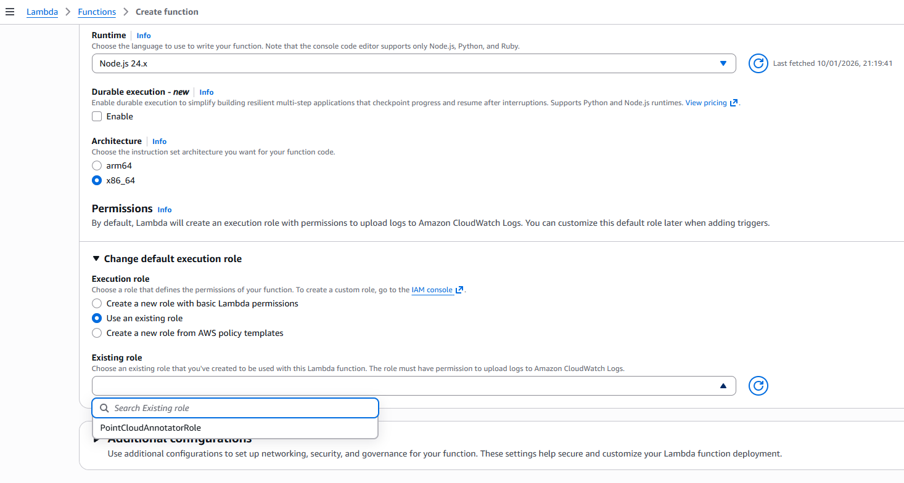
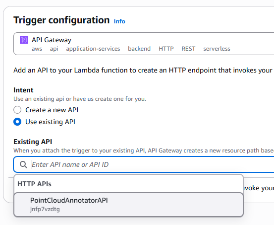
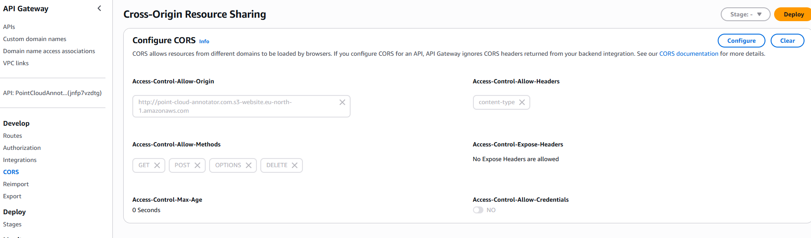
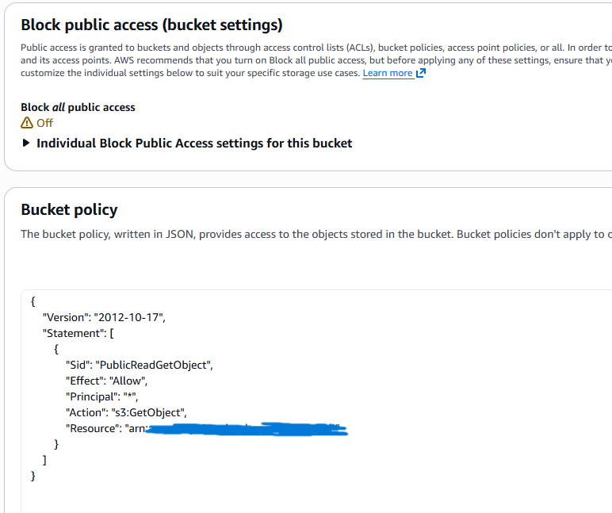
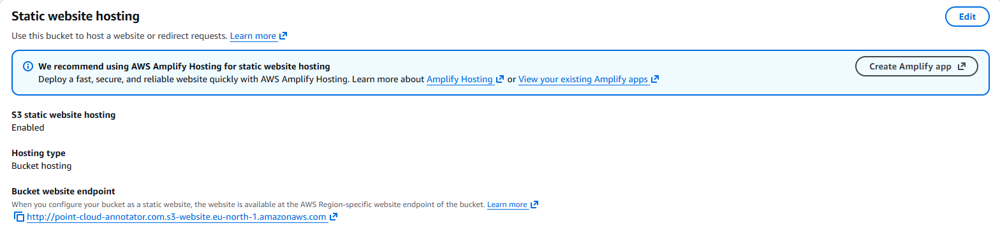

# Prerequisites
Please make sure that these are installed on your computer before trying to run it locally:
1. [AWS SAM CLI](https://docs.aws.amazon.com/serverless-application-model/latest/developerguide/install-sam-cli.html) (configured with your credentials)
2. [Docker](https://www.docker.com/products/docker-desktop/)
3. [NPM and Node.js 18+](https://docs.npmjs.com/downloading-and-installing-node-js-and-npm)
4. [Git](https://git-scm.com/install/windows)

# Running locally
1. We'll start by installing and preparing a local AWS emulator:
   - `npm install`
   - `npm run setup`
     - This setup would take care of the rest. (It will create a DynamoDB docker container for AWS, and prepare the local table for the app)
     - Note: The backend will not work if DynamoDB docker is not running. (`npm run db:start`)
2. We should be able to run it now! :)
   - `npm run dev`


# Technical Requirements
1. Point Cloud Display:
- [x] Use Potree or similar viewer to load and display a point cloud
  - This code uses Potree.
- [x] You can use the sample point cloud: lion_takanawa or any other LAZ file
  - It uses lion_takanawa
- [x] A good reference for the desired functionality is the official Potree annotations
  example
  - Studied how Potree handles annotations
2. Annotation Functionality:
  - [x] Create: A user must be able to click on any point in the 3D scene. This action should create an annotation "marker" at that 3D coordinate.
    - You can create any point in the 3D scene as long as it touches the object by **clicking on the mouse scroll**.
  - [x] Data: When an annotation is created, the user should be able to attach a simple string to it (max 256 bytes). This could be done via a simple text input box that appears.
    - Each string must be not empty and must not exceed 256 bytes (doesn't matter if its Unicode or not).
  - [x] Delete: A user must be able to delete existing annotations.
    - Hovering annotations would show additional actions on that annotation, such as edit and delete.
3. Persistence Layer:
   - [x] Annotations must be saved so they are re-loaded when the page is refreshed.
   - [x] Create a serverless backend using AWS Services.
   - [x] We would be very impressed to see a solution using API Gateway to trigger a Lambda function that reads/writes from a NoSQL database like DynamoDB.
4. Deployment:
   - [x] Please provide clear instructions on how to run your project. 
     - See *Running Locally*
   - [x] The frontend is hosted as a static website on an AWS S3 bucket.
     - Deployed to http://point-cloud-annotator.com.s3-website.eu-north-1.amazonaws.com/

# Brief Description
### Frontend
- **Why TypeScript**: I prefer to use TypeScript when its possible due to its typesafety and easier bug finding.
- **Why Vite**: I chose it for fast HMR and optimised production builds.
- **Why Vanilla JavaScript instead of React/Angular**: All of the Potree examples and documentation I found were in vanilla JS, so I chose to work directly with the library's native API rather than adding unnecessary abstraction layers.

### Backend
- **Why label instead of id in DynamoDB**: I wanted to make sure that there will be only unique values in DynamoDB, so I just used the label as the primary key.
- **Why JavaScript instead of TypeScript for backend**: The backend consists of only 3 simple Lambda functions, so I opted for JavaScript to avoid the overhead of TypeScript compilation and build configuration.

### Key Design Decisions
1. **Middle-click for annotation**: Prevents accidental placement during camera navigation
2. **Hover actions**: Discoverability without cluttering the 3D view
3. **Client-side validation**: 256-byte check before API call
4. **CORS configuration**: Wildcards for development; restrict in production.

### API Endpoints

| Method | Endpoint | Description                   |
|--------|----------|-------------------------------|
| PUT    | `/addAnnotation` | Create new annotation         |
| GET    | `/getAllAnnotations` | Fetch all annotations         |
| DELETE | `/removeAnnotation` | Delete annotation by label/ID |

#### Request/Response Examples

**PUT /addAnnotation**
```json
{
  "label": "Roar",
  "x": 1.23, 
  "y": 4.56, 
  "z": 7.89
}
```

**GET /getAllAnnotations**
```json
{
  "annotations": [
    {
      "label": "Roar",
      "x": 1.23,
      "y": 4.56,
      "z": 7.89
    }
  ],
  "count": 1
}
```

# Deployment
1. First of all, we need to build the project:
   - Run `npm run build`, this would create `dist` folder with the built project.
2. I configured it from AWS Management Console, so we'll need to log in to the console.
3. We need to create a new permission policy for DynamoDB and the Lambda functions, we can do that in `IAM > Roles > Create Role > Add permissions > Create inline policy`:
   ```json
    {
       "Version": "2012-10-17",
       "Statement": [
           {
               "Effect": "Allow",
               "Action": [
                   "dynamodb:Scan", // So our lambdas can scan the table
                   "dynamodb:PutItem", // add a new element to the table
                   "dynamodb:DeleteItem" // and delete an element from the table
               ],
               "Resource": "arn:aws:dynamodb:eu-north-1:427029328368:table/PointCloudAnnotator"
           }
       ]
    }
    ```
4. Now we need to create the lambdas by clicking on `Create function` and use our existing role:
   - 
   - Then we need to just copy paste our code into the lambdas.
   - Lastly, we just need to add a trigger for API Gateway and make sure to use the same API Gateway that we create for the first lambda.
   - 
5. Configuring CORS
   - We then need to change:
     - Access-Control-Allow-Origin: Your website URL
     - Access-Control-Allow-Methods: GET, PUT, OPTIONS, DELETE
     - Access-Control-Allow-Headers: content-type or *
   - 
6. Lastly, just create a bucket with the default settings, and change its policy to: 
   - 
   - We also need to enable static website hosting:
   - 
   - Upload your `dist` folder and that's it! You're done! (For parallel uploading you can also do `aws s3 sync dist/ s3://bucket-name/`)
